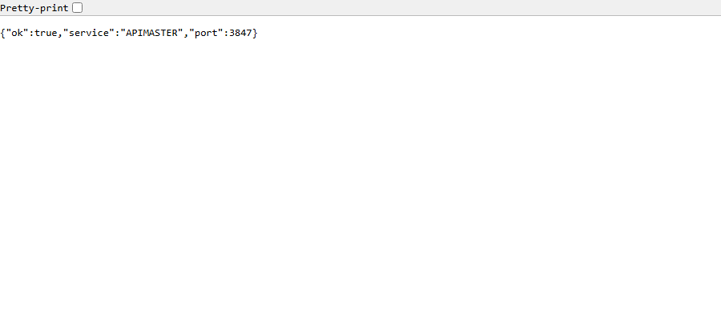
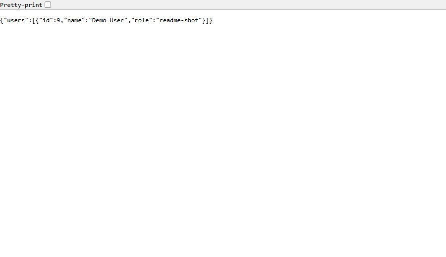
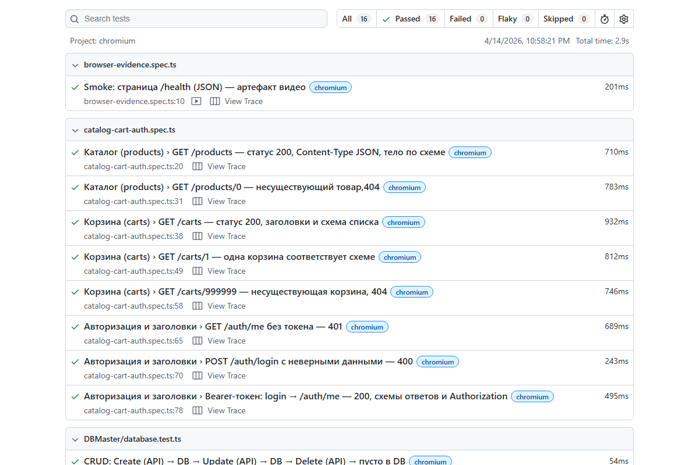

# APIMASTER

Фреймворк для проверки REST API и SQLite: Playwright (TypeScript), локальный Express API, сравнение ответов API с состоянием базы.

**Разработчик проекта: [Space108] — AI Developer & AI Full-stack Quality**

## Скриншоты

Локальный API в браузере, пример JSON и фрагмент HTML-отчёта Playwright после полного прогона.

Обновить картинки: **`npm run docs:screenshots`** (сначала полный `npm test` внутри скрипта, затем съёмка).

| GET `/health` | GET `/api/users` |
|---------------|------------------|
|  |  |

Фрагмент отчёта:



## Требования

- Node.js 18+
- Сеть (тесты ходят в jsonplaceholder и dummyjson)

## Установка

```bash
npm install
```

## База данных

Файл SQLite: **`data/api_master.sqlite`** (каталог `data/` создаётся автоматически при первом запуске API или `direct_db.js`).

Таблицы:

- `users` — CRUD через локальный API
- `test_audit` — снимки JSON ответов внешних API для проверки round-trip

Ручной сид (пересоздаёт `users`):

```bash
node direct_db.js
```

## Локальный API

```bash
npm run api
```

Сервис: `http://127.0.0.1:3847` (порт задаётся переменной `APICENTER_PORT`).

- `GET /health` — проверка живости
- `GET|POST /api/users`, `GET|PUT|DELETE /api/users/:id`
- `DELETE /api/users` — полная очистка `users` (только при `APIMASTER_TEST_MODE=1`)

## Тесты

```bash
npm test
```

### Чеклист тестирования (по шагам)

Используй перед релизом, после смены ветки или правок API/БД.

1. **Окружение** — Node.js 18+, установлены зависимости: `npm install`.
2. **Чистое состояние** — при необходимости удали локальные артефакты: `test-results/`, `playwright-report/` (они пересоздадутся).
3. **База** — убедись, что порт `3847` свободен (его занимает `webServer` при тестах). Файл `data/api_master.sqlite` создаётся сам; при сомнениях можно пересидить: `node direct_db.js` (не обязательно перед `npm test`).
4. **Полный прогон** — `npm test` — все спеки должны быть **passed**.
5. **Проверка отчётов** — открой `npm run test:report` и пройдись по упавшим/медленным тестам (если есть).
6. **Интерактивно (по желанию)** — `npm run test:ui` — ручной прогон и отладка отдельных тестов.
7. **API + БД** — сценарии из `tests/DBMaster/database.test.ts`: CRUD, пустая таблица после удаления, негативы (null, длина строки, SQL-инъекция как литерал).
8. **Внешние API** — `tests/catalog-cart-auth.spec.ts` и `tests/first-api.spec.ts` требуют **интернет** (dummyjson, jsonplaceholder).
9. **Артефакты** — при падении: `test-results/bug-reports/*.md`, вложения в HTML-отчёте, `trace.zip` для воспроизведения.
10. **Скриншоты в README (по желанию)** — после смены UI/отчёта: `npm run docs:screenshots`.

### Как смотреть процесс «вживую»

| Что | Зачем |
|-----|--------|
| **`npm run test:ui`** | Режим **Playwright UI**: пошаговый прогон, таймлайн, повтор шагов, удобнее всего «смотреть в реале». |
| **`npm run test:report`** | После `npm test` открыть **HTML-отчёт** в `playwright-report/` (результаты, вложения, ссылки на trace). |
| **`npx playwright show-trace путь/к/trace.zip`** | **Trace Viewer**: сеть (включая вызовы `request`), тайминг, DOM для тестов с `page`. Путь к `trace.zip` удобно брать из HTML-отчёта (вложения у каждого теста). |

### Что реально пишется на диск

- **Видео (`video.webm`)** — для тестов, где используется браузер (**`{ page }`**). Чисто API-тесты с **`{ request }`** страницу не открывают, поэтому отдельного «ролика браузера» там нет — зато в **trace** всё равно видно **HTTP**.
- **Скриншоты** — локально: **`screenshot: 'on'`** (после теста с `page`); в CI остаётся только при падении.
- **Trace (`trace.zip`)** — локально на **каждый** тест (`trace: 'on'`), в CI — только при падении (`retain-on-failure`).
- **HTML-отчёт** — каталог **`playwright-report/`** (отдельно от `test-results/`, чтобы не затирать trace и видео).
- **Bug-reports** — `test-results/bug-reports/*.md` при падении (кастомный репортёр).

Опционально: **`npm run test:headed`** — тот же прогон с видимым окном Chromium (удобно вместе с тестами на `page`).

Playwright поднимает API через `webServer` в `playwright.config.ts`, складывает артефакты в `test-results/`.

Основные файлы:

| Путь | Назначение |
|------|------------|
| `tests/DBMaster/database.test.ts` | CRUD + сверка с SQLite + негативные кейсы |
| `tests/catalog-cart-auth.spec.ts` | DummyJSON: каталог, корзины, авторизация, аудит в БД |
| `tests/first-api.spec.ts` | JSONPlaceholder + JSON Schema |
| `tests/browser-evidence.spec.ts` | Браузерный смоук `/health` (видео) |

## Переменные окружения

| Переменная | Описание |
|------------|----------|
| `APIMASTER_TEST_MODE=1` | Разрешить массовое удаление пользователей (выставляется для `webServer` в тестах) |
| `APICENTER_PORT` | Порт локального API (по умолчанию `3847`) |
| `CI` | Включает `forbidOnly` и retries в Playwright |

## Репозиторий

Проект на GitHub: **[github.com/Space108/ApiMaster](https://github.com/Space108/ApiMaster)**

Клонирование:

```bash
git clone https://github.com/Space108/ApiMaster.git
cd ApiMaster
npm install
```

Дальнейшие изменения:

```bash
git add .
git commit -m "Описание изменений"
git push origin main
```

---

**Разработчик проекта: [Space108] — AI Developer & AI Full-stack Quality**
